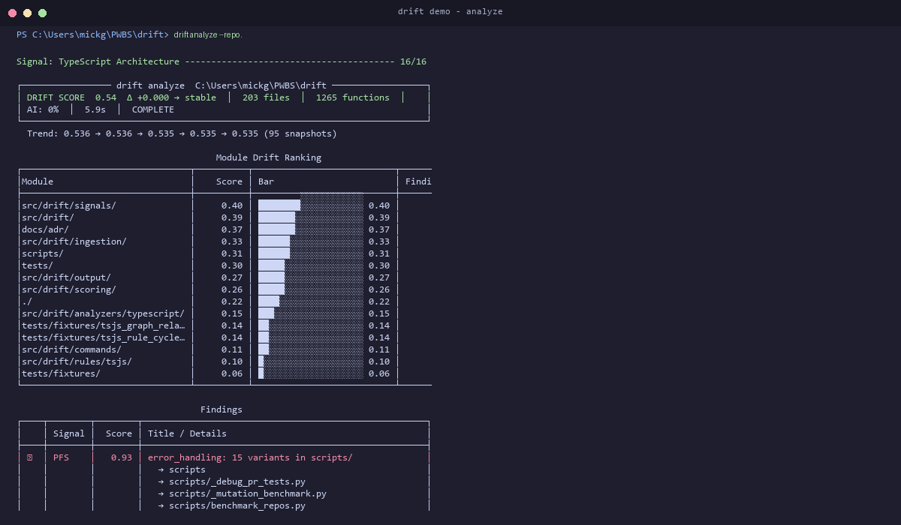

# Drift — Codebase Coherence Analyzer

[](https://github.com/sauremilk/drift/actions/workflows/ci.yml)
[](https://codecov.io/gh/sauremilk/drift)
[](https://pypi.org/project/drift-analyzer/)
[](https://pypi.org/project/drift-analyzer/)
[](https://www.python.org/)
[](LICENSE)
[](https://pre-commit.com)
[](https://docs.github.com/en/code-security/code-scanning)
[](https://www.typescriptlang.org/)
[](https://github.com/astral-sh/ruff)
[](https://github.com/sauremilk/drift)
[](https://sauremilk.github.io/drift/)

**Surface architectural drift patterns that often appear in fast-moving and AI-assisted codebases.**

Drift is a deterministic static analyzer for teams that want to catch loss of architectural coherence early: fragmented patterns, layer violations, near-duplicates, unstable hotspots, and other signs that code still works locally but is getting harder to maintain globally.



Reproducible terminal recording via [demos/demo.tape](demos/demo.tape).

## Why drift

AI-assisted development is fast, but speed often hides structural erosion:

- the same concern gets implemented multiple ways
- imports cross architectural boundaries
- copy-paste variants accumulate
- hotspots churn faster than teams can reason about them

Drift does not try to replace linters, security scanners, or type checkers.
It complements them by surfacing architecture and coherence problems that are easy to miss in fast-moving repositories.

## 2-minute quickstart

```bash
pip install drift-analyzer

# local scan
drift analyze --repo .

# CI gate
drift check --fail-on high
```

GitHub Action:

```yaml
name: Drift

on: [push, pull_request]

jobs:
  drift:
    runs-on: ubuntu-latest
    permissions:
      contents: read
      security-events: write

    steps:
      - uses: actions/checkout@v4
        with:
          fetch-depth: 0

      - uses: sauremilk/drift@v1
        with:
          fail-on: high
          upload-sarif: "true"
```

More setup paths:

- [Quick Start](docs-site/getting-started/quickstart.md)
- [Configuration](docs-site/getting-started/configuration.md)
- [Team Rollout](docs-site/getting-started/team-rollout.md)

## What you get

```text
╭─ drift analyze  myproject/ ──────────────────────────────────────────────────╮
│  DRIFT SCORE  0.52  │  87 files  │  412 functions  │  AI: 34%  │  2.1s      │
╰──────────────────────────────────────────────────────────────────────────────╯

                        Module Drift Ranking
  Module                           Score  Findings  Top Signal
  ─────────────────────────────────────────────────────────────
  src/api/routes/                   0.71       12   PFS 0.85
  src/services/auth/                0.58        7   AVS 0.72
  src/db/models/                    0.41        4   MDS 0.61

┌──┬────────┬───────┬──────────────────────────────────────┬──────────────────────┐
│  │ Signal │ Score │ Title                                │ Location             │
├──┼────────┼───────┼──────────────────────────────────────┼──────────────────────┤
│◉ │ PFS    │  0.85 │ Error handling split 4 ways          │ src/api/routes.py:42 │
│◉ │ AVS    │  0.72 │ DB import in API layer               │ src/api/auth.py:18   │
│○ │ MDS    │  0.61 │ 3 near-identical validators          │ src/utils/valid.py   │
└──┴────────┴───────┴──────────────────────────────────────┴──────────────────────┘
```

Drift currently reports six active signal families:

- `PFS` Pattern Fragmentation
- `AVS` Architecture Violations
- `MDS` Mutant Duplicates
- `EDS` Explainability Deficit
- `TVS` Temporal Volatility
- `SMS` System Misalignment

Signal details and scoring model:

- [Signal Reference](docs-site/algorithms/signals.md)
- [Algorithm Deep Dive](docs-site/algorithms/deep-dive.md)
- [Scoring Model](docs-site/algorithms/scoring.md)

## Use drift if...

- you want to review structural coherence, not just syntax or style
- you want a deterministic complement to AI-assisted code review
- you care about trends and hotspots across modules, not only isolated lint findings
- you need CLI, CI, JSON, and SARIF outputs without adding LLM infrastructure

## Don't use drift if...

- you expect bug finding, security scanning, or type safety enforcement
- you need zero false positives on a tiny repository from day one
- you want one absolute score to replace code review judgment

Drift is most useful when teams treat the score as orientation and the findings as investigation prompts.

## Small-team rollout

The safest adoption path is progressive:

1. Start with `drift analyze` locally and review the top findings.
2. Add `drift check` in CI as report-only discipline for a short period.
3. Gate only on `high` findings once the team understands the output.
4. Tune config and policies only after reviewing real findings in your repo.

Recommended guides:

- [Team Rollout](docs-site/getting-started/team-rollout.md)
- [Finding Triage](docs-site/getting-started/finding-triage.md)
- [Benchmarking and Trust](docs-site/benchmarking.md)

## Trust and limitations

Drift is designed to earn trust through determinism and reproducibility:

- no LLMs in the detection pipeline
- reproducible CLI and CI output
- signal-specific interpretation instead of score-only messaging
- explicit benchmarking and known-limitations documentation

Start with the strongest, most actionable findings first. If a signal is noisy for your repository shape, tune or de-emphasize it instead of forcing an early hard gate.

Further reading:

- [Benchmarking and Trust](docs-site/benchmarking.md)
- [Full Study](STUDY.md)
- [Case Studies](docs-site/case-studies/index.md)

## Documentation map

- [Getting Started](docs-site/getting-started/quickstart.md)
- [How It Works](docs-site/algorithms/deep-dive.md)
- [Benchmarking and Trust](docs-site/benchmarking.md)
- [Product Strategy](docs-site/product-strategy.md)
- [Contributor Guide](CONTRIBUTING.md)
- [Developer Guide](DEVELOPER.md)

## Status

drift has working CLI, GitHub Action, configuration, JSON/SARIF output, benchmark material, and active tests.

Feature maturity should still be read pragmatically:

- core Python analysis: stable
- CI and SARIF workflow: stable
- benchmark claims: documented, but should be interpreted per signal and methodology
- TypeScript support and selected advanced signals: evolving

## License

MIT. See [LICENSE](LICENSE).
